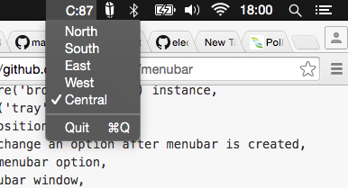

# PM2.5 (*Mac-only for now*)

  > Because I’m sick of reading 3-hour moving averages.

  

  **Download:** https://github.com/yinshanyang/pm2.5/releases/latest

## Why PM2.5?

  Because out of the various [measurements that NEA takes](http://www.haze.gov.sg/haze-updates/pollutant-concentrations/type/PM25-1Hr), the PM2.5 is a hourly 1-hour average, meaning it’s more responsive as a measure overall, as opposed to the hourly 3-hour moving average.

## PM2.waaah? What Numbers are these?

  The numbers represented is the deprived [Air Quality Index (AQI)](https://en.wikipedia.org/wiki/Air_quality_index) based on the hourly PM2.5 readings. It is comparable to the PSI.

## Where does the Data Come From?

  Well, we are scraping it from here: http://www.haze.gov.sg/haze-updates/pollutant-concentrations/type/PM25-1Hr

# What Completely Sucks with this App?

  - An icon. The app totally needs an icon. Probably something grey.
  - 100-odd mega-ga-gi-bytes for a puny app like this? Yes. I know. The size is excessive. But it’s a 0.1.0 release, and I’ll have to trim the fat out of the wonderful [Electron](http://electron.atom.io/) to get the size down. Oh yea, have I mentioned? This is built with the awesome [Electron](http://electron.atom.io/).

